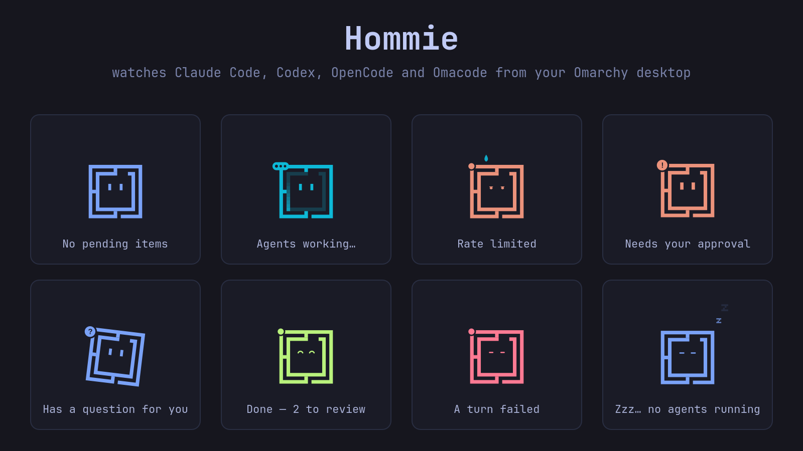

# Hommies



Hommie is a floating companion for the Omarchy desktop that watches your coding
agents (Claude Code, Codex, OpenCode, and Omacode). When an agent asks for a
permission, asks you a question, or finishes a turn, Hommie's mood changes and
the item shows up in a card beside it and in a bell in the top bar. You can
approve or decline permissions and answer questions from there, or leave the
answer to the agent's own prompt and use Hommie as a read-only mirror.

## Requirements

- Omarchy 4 (Quattro shell)
- Node.js 20.10 or newer
- The companion npm package `@thisisayande/hommies`, which provides the local
  bridge (`hommies-bridge`) this plugin starts. Its source is in
  [ayandexyz/Hommies](https://github.com/ayandexyz/Hommies) under
  `packages/omarchy-bridge`.

## Install

1. Install the companion package:

   ```sh
   npm install -g @thisisayande/hommies@0.1.3
   ```

2. Add the plugin:

   ```sh
   omarchy plugin add https://github.com/ayandexyz/hommies-plugin
   ```

   Then enable it and add **Hommies** to the bar from the Omarchy plugin
   settings.

3. Connect your agents. This is a separate step that you choose to run.

   Hommie only sees an agent that reports to the bridge. Omacode reports to it
   out of the box. Claude Code, Codex, and OpenCode each need an entry in their
   own config: a hook in `~/.claude/settings.json` or `~/.codex/hooks.json`, or a
   plugin entry in `~/.config/opencode/opencode.json`.

   **This plugin never creates or edits those files.** The companion package
   can add the entries when you run it yourself:

   ```sh
   hommies setup
   ```

   It lists the agents it finds and asks which ones to connect, and it saves a
   copy of each config next to it (`<file>.hommies-backup-<time>`) before
   changing it. For Codex, approve the new hooks in its `/hooks` screen; restart
   OpenCode to load its plugin. To add the entries by hand instead, follow the
   [manual setup](https://github.com/ayandexyz/Hommies/blob/main/packages/omarchy-bridge/README.md)
   sections.

## Remove

```sh
hommies uninstall
npm uninstall -g @thisisayande/hommies
omarchy plugin remove io.github.ayandexyz.hommies
```

`hommies uninstall` takes out only the entries `hommies setup` added and keeps
the rest of each config. Run it before removing the npm package. Hooks left
behind by removing the package first do nothing, except OpenCode's `plugin`
entry, which you then delete from `~/.config/opencode/opencode.json` by hand.

## What it does on your machine

- Runs with your normal user permissions.
- The plugin starts one background process, `hommies-bridge`, and restarts it
  if it exits.
- The bridge listens on `127.0.0.1` only, on a random port, and every request must
  carry a random token. It writes the port and token to
  `$XDG_DATA_HOME/hommies/port.json`.
- Pending items are kept in memory and are lost when the bridge stops. Hommie's
  own preferences are saved in `$XDG_DATA_HOME/hommies/floating.json`.
- Desktop notifications use `notify-send`; optional sounds use `pw-play` or `paplay`.
- No telemetry, analytics, or update checks. Nothing leaves your machine.
- The plugin contains no code that installs, edits, or removes agent hooks or
  agent config. Only the companion package's `hommies setup` and
  `hommies uninstall` do that, and only when you run them.

If the bridge is not running, every agent falls back to its own normal prompt.

## Settings

Right-click Hommie for its settings: whether questions are answered here or in
the agent's CLI, desktop notifications, sounds, showing over fullscreen windows,
and moving it to the next monitor. Drag it to move it. The bar bell has the same
answer-surface, notification, and sound settings.

## Source

The bridge, the agent hooks, and development notes live in
[ayandexyz/Hommies](https://github.com/ayandexyz/Hommies). Report issues there.

## License

MIT. See [LICENSE](LICENSE).
